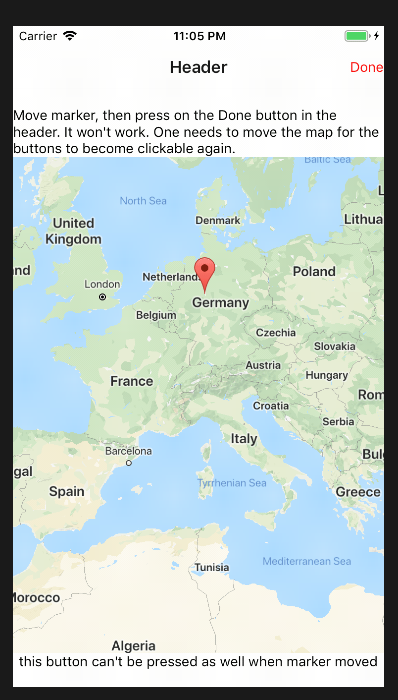

## rnMapsNavigationBug
Thsi repository shows a bug with react-native-maps and react-navigation v3

When the map has a draggable marker and one drags the marker one is no longer
able to press any buttons on the screen afterwards. The user needs to move
the map again in order for the buttons to become responsive.

This has been working with react-navigation <= 2.18.3, so I'm assuming that
the bug has something to do with the the introduction of react-native-gesture-handler.


## installation
```
$ yarn
$ react-native run-ios
```
